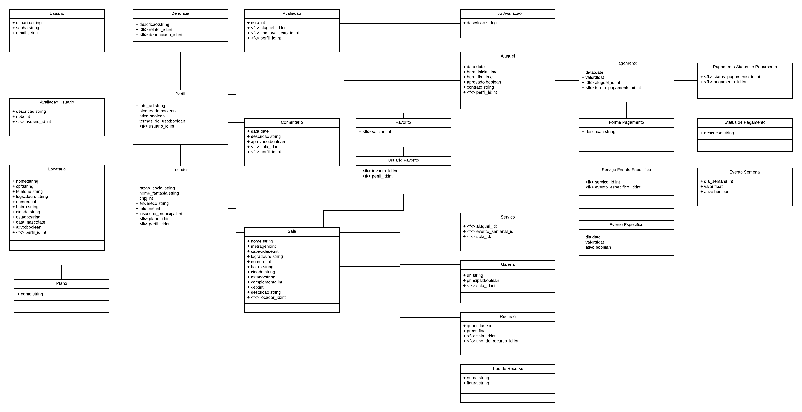

# Banco de dados

O SGBD utilizado será o PostgreSQL e o diagrama de classes utilizado no Django ORM será:

Disponível em:
[Link para o LucidChart](https://www.lucidchart.com/documents/edit/ce068490-1548-49e1-b1ef-bcba4cc8e984/0)
